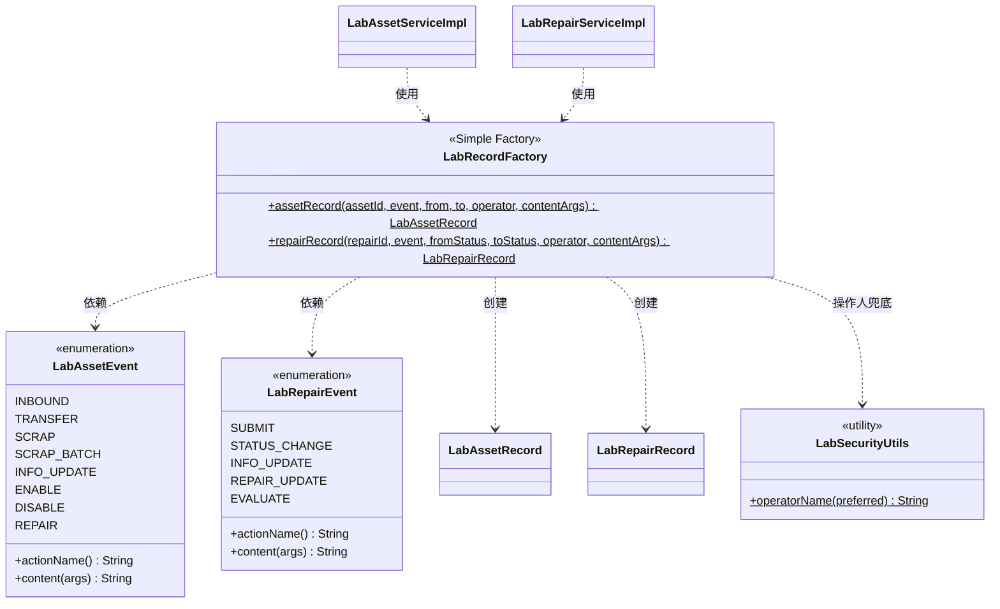

# T5 设计模式落地（简单工厂）

| 项 | 值 |
| --- | --- |
| **优先级** | P1 |
| **依赖** | **T1 必须先完成**（改造要有测试兜底，否则回归无从发现） |
| **阻塞** | 交付物 2《软件架构设计文档》的「设计模式（8 分）+ 简化类图」 |
| **产出** | 2 个枚举 + 1 个工厂类 + 2 个 Service 的调用点改造 + 一份类图文件 |

---

## 1. 目标

任务书要求「至少使用 1 种**创建型或结构型**模式，画出简化类图」，这是架构文档里**单项分值最高的一档（8 分）**。但当前代码里没有显式的设计模式——为了凑分而硬塞一个模式，教师一问就穿帮。

所以本卡选的是一个**真实存在的问题**，用它把模式落进去。

### 1.1 真实问题：履历记录的构造逻辑散落在两个 Service 的 11 处

系统有两条业务流水线：`lab_asset_record`（资产履历）和 `lab_repair_record`（报修履历）。它们的构造目前靠两个私有方法 + 人工记忆：

| 位置 | 调用点数 | 手写的部分 |
| --- | --- | --- |
| `LabAssetServiceImpl` | 6 处 | 记录类型字符串（"入库"/"调拨"/"报废"/"资料修改"/"启用"/"停用"/"维修"）、from/to 语义、文案模板、操作人兜底 |
| `LabRepairServiceImpl` | 5 处 | 动作名（"提交报修"/"状态流转"/"维修信息更新"/"报修信息更新"/"维修评价"）、from/to 状态、文案模板 |

**这带来三个真实问题**：

1. **文案格式靠人工保证一致**。`"报修状态由“X”变更为“Y”"` 这种模板一旦要改措辞，得改 3 个地方，很容易漏。
2. **新增一种履历事件要改调用方**——比如以后要加"资产盘点""设备借出"，得同时改 Service 和新增一堆字符串，**违反 OCP**。
3. **操作人兜底逻辑（`LabSecurityUtils.operatorName`）和 `createBy` 的赋值在每处重复**，漏一处就会出现操作人为空的履历记录。

### 1.2 解决方式：简单工厂 + 事件枚举

- 把「记录类型」抽成**枚举**（`LabAssetEvent` / `LabRepairEvent`），枚举自己承载**动作名**与**文案模板**
- 新增 **`LabRecordFactory`**（简单工厂，创建型），集中负责「把一次业务事件组装成一条履历对象」
- Service 侧从「自己拼对象、自己拼文案」退化为「声明发生了什么事件」，**新增事件类型时两个 Service 零改动**

**为什么这算"恰当使用模式"而不是硬凑**：它命中的是任务书评分表里「设计模式使用恰当性」要的东西——**模式解决了真实存在的重复与扩展性问题**，且顺带满足了 DRY。这一点答辩时要讲清楚。

---

## 2. 交付内容（验收标准）

### 2.1 新增文件（4 个）

**① `constant/LabAssetEvent.java`** —— 资产履历事件枚举

```java
public enum LabAssetEvent
{
    INBOUND     ("入库",     "资产入库：%s"),
    TRANSFER    ("调拨",     "资产所属实验室调整：%s → %s"),
    SCRAP       ("报废",     "资产删除或报废"),
    SCRAP_BATCH ("报废",     "资产批量删除或报废"),
    INFO_UPDATE ("资料修改", "资产基础资料更新"),
    ENABLE      ("启用",     "资产状态变更"),
    DISABLE     ("停用",     "资产状态变更"),
    REPAIR      ("维修",     "资产状态变更");

    private final String actionName;
    private final String contentTemplate;

    public String actionName();
    public String content(String... args);
}
```

**② `constant/LabRepairEvent.java`** —— 报修履历事件枚举

```java
public enum LabRepairEvent
{
    SUBMIT          ("提交报修",   "故障等级：%s；%s"),
    STATUS_CHANGE   ("状态流转",   "报修状态由“%s”变更为“%s”"),
    INFO_UPDATE     ("报修信息更新", "报修单信息已更新"),
    REPAIR_UPDATE   ("维修信息更新", "报修单信息已更新"),
    EVALUATE        ("维修评价",   "评分：%s；%s");

    public String actionName();
    public String content(String... args);
}
```

**③ `constant/LabRecordFactory.java`** —— 简单工厂

```java
public final class LabRecordFactory
{
    /** 创建一条资产履历记录。操作人为空时由 LabSecurityUtils 兜底。 */
    public static LabAssetRecord assetRecord(Long assetId, LabAssetEvent event,
            String fromValue, String toValue, String operator, String... contentArgs);

    /** 创建一条报修履历记录。 */
    public static LabRepairRecord repairRecord(Long repairId, LabRepairEvent event,
            String fromStatus, String toStatus, String operator, String... contentArgs);

    private LabRecordFactory() { }
}
```

**④ `docs/大作业/设计模式-类图.md`** —— 供架构文档直接取用的类图（用 Mermaid，文档组可直接渲染或转图）

### 2.2 改造既有代码（2 个文件）

- [ ] `LabAssetServiceImpl`：6 处 `insertAssetRecord(...)` 调用改为调用工厂
- [ ] `LabRepairServiceImpl`：5 处 `insertRepairRecord(...)` 调用改为调用工厂
- [ ] 两个 Service 里原有的 `insertAssetRecord` / `insertRepairRecord` 私有方法可以保留为**极薄的转发**（内部调工厂），也可以直接删掉——**二选一，不要留两套并行的实现**
- [ ] 改造后 `LabStatusUtils.assetRecordType` 若变成无人调用，**保留**并在注释里说明它仍是字典口径参考（或改为由 `LabAssetEvent` 内部复用），**不要直接删**——它对前端字典展示仍有参考价值

### 2.3 铁律：**行为必须逐字不变**

改造是纯重构，**不允许改变任何对外可见的行为**。以下字符串必须逐字保留（包括中文引号的写法）：

| 来源 | 必须保留的字符串 |
| --- | --- |
| `LabAssetServiceImpl` | `资产入库：`、`资产所属实验室调整`、`资产状态变更`、`资产基础资料更新`、`资产删除或报废`、`资产批量删除或报废` |
| `LabRepairServiceImpl` | `提交报修`、`状态流转`、`报修状态由“` + `”变更为“` + `”`、`报修信息更新`、`维修信息更新`、`报修单信息已更新`、`维修评价`、`评分：`、`故障等级：`、`；` |

> 注意 `statusOrText()` 的空值兜底（空 → `"-"`）也必须保留，它是现有行为的一部分。

### 2.4 类图（Mermaid，直接写进 `设计模式-类图.md`）



### 2.5 架构文档的对应章节要点（写文档时用）

| 要求 | 怎么写 |
| --- | --- |
| 模式选型 | 简单工厂（Simple Factory），属**创建型**模式 |
| 应用场景 | 系统有 11 处需要把业务事件转成履历记录，构造规则（动作名、文案模板、操作人兜底）分散在 2 个 Service 中 |
| 解决的问题 | ①文案模板集中，改一处生效全站 ②新增履历事件只加枚举常量，Service 零改动（OCP）③操作人兜底不再可能漏写 ④DRY |
| **为什么不选状态模式** | **主动写一段说明**：报修状态流转目前只有 3 个分支的 `if-else`（0→1/0→4、1→2、2→3），引入状态模式需要 5 个状态类 + 上下文类，代码量翻 5 倍而可读性提升有限，**属于过度设计**。如果未来状态数超过 6 个或出现"同一状态下按角色走不同分支"，再重构才划算。<br>**这一段是加分项——它证明我们不是"为模式而模式"。** |

---

## 3. 边界（**不要做**）

- **不要**改任何业务逻辑、校验规则、权限判定、状态机分支。本卡是**纯重构**。
- **不要**改 mapper XML、数据库字段、接口签名。
- **不要**引入 Lombok、MapStruct 之类的注解处理器（离线构建拉不到 jar）。
- **不要**为了"更优雅"顺手把 `statusOrText()` 或 `LabStatusUtils` 改掉行为。
- **不要**在前端做任何改动。
- **不要**在 `LabRecordFactory` 里加缓存、加日志、加 Spring 依赖——它必须是一个**无状态的纯静态工具类**（这样单元测试无需 Spring 上下文）。

---

## 4. 提示词（复制给编码 Agent）

```
你是本项目的后端开发。项目是若依 RuoYi-Vue 3.9.2 二次开发的
「高校实验室资产与报修管理平台」，工作目录 D:\code\Manager_system，
后端 RuoYi-Vue-fast，自定义业务在 com.ruoyi.project.laboratory 包下。

【任务背景】
系统有两条业务流水：lab_asset_record（资产履历）和 lab_repair_record（报修履历）。
目前它们的构造逻辑靠两个私有方法 + 手写字符串，散落在 11 个调用点上：
  - LabAssetServiceImpl 有 6 处调用 insertAssetRecord(...)
  - LabRepairServiceImpl 有 5 处调用 insertRepairRecord(...)
导致：文案模板改一处要改多处、新增履历事件必须改 Service（违反 OCP）、
操作人兜底逻辑重复且漏写难发现。

【任务】用「简单工厂 + 事件枚举」重构，把履历对象的创建收口到一个工厂里。
这是一次【纯重构】，不允许改变任何对外可见的行为。

【第一步：先读这三个文件，逐字抄下现有的字符串，一个标点都不能错】
1) RuoYi-Vue-fast/src/main/java/com/ruoyi/project/laboratory/service/impl/LabAssetServiceImpl.java
   重点看 insertAssetRecord 的 6 个调用点（insertLabAsset、deleteLabAssetByAssetId、
   deleteLabAssetByAssetIds、recordAssetUpdate 里的 3 处）
2) .../service/impl/LabRepairServiceImpl.java
   重点看 insertRepairRecord 的 5 个调用点（insertLabRepair、updateLabRepair 的 2 处、
   evaluateLabRepair）
3) .../util/LabSecurityUtils.java 和 .../util/LabStatusUtils.java

【第二步：新增 3 个类，都在 com.ruoyi.project.laboratory.constant 包下】

1) LabAssetEvent（枚举）—— 资产履历事件
   常量与文案模板（【逐字照抄现有代码，不要改动任何字】）：
     INBOUND     actionName="入库"    template="资产入库：%s"
     TRANSFER    actionName="调拨"    template="资产所属实验室调整：%s → %s"
     SCRAP       actionName="报废"    template="资产删除或报废"
     SCRAP_BATCH actionName="报废"    template="资产批量删除或报废"
     INFO_UPDATE actionName="资料修改" template="资产基础资料更新"
     ENABLE      actionName="启用"    template="资产状态变更"
     DISABLE     actionName="停用"    template="资产状态变更"
     REPAIR      actionName="维修"    template="资产状态变更"
   提供 public String actionName() 和 public String content(String... args)（用 String.format 填充模板）。
   【注意】ENABLE / DISABLE / REPAIR 三个的 actionName 对应现有
   LabStatusUtils.assetRecordType(status) 的返回："启用"/"停用"/"维修"，
   template 都是"资产状态变更"。

2) LabRepairEvent（枚举）—— 报修履历事件
     SUBMIT        actionName="提交报修"     template="故障等级：%s；%s"
     STATUS_CHANGE actionName="状态流转"     template="报修状态由“%s”变更为“%s”"
     INFO_UPDATE   actionName="报修信息更新"  template="报修单信息已更新"
     REPAIR_UPDATE actionName="维修信息更新"  template="报修单信息已更新"
     EVALUATE      actionName="维修评价"     template="评分：%s；%s"
   【关键】STATUS_CHANGE 的模板里用的是中文全角引号 “ 和 ”，
   与现有 LabRepairServiceImpl 第 148-149 行完全一致，不要换成英文引号。

3) LabRecordFactory（简单工厂，public final class，私有构造器）
   两个静态工厂方法：
     public static LabAssetRecord assetRecord(Long assetId, LabAssetEvent event,
             String fromValue, String toValue, String operator, String... contentArgs)
     public static LabRepairRecord repairRecord(Long repairId, LabRepairEvent event,
             String fromStatus, String toStatus, String operator, String... contentArgs)
   职责（集中所有原先散落的赋值规则）：
     - 设置主键关联字段（assetId / repairId）
     - 设置 recordType = event.actionName()
     - 设置 fromValue/toValue（报修侧是 fromStatus/toStatus）
     - 设置 recordContent = event.content(contentArgs)
     - 操作人走 LabSecurityUtils.operatorName(operator) 兜底
     - createBy 设为与 operatorName 相同的值（这是现有行为，别丢）
   【硬性】不要加 Spring 注解、不要加缓存、不要加日志。它是无状态纯静态工具类，
   单元测试要在没有 Spring 上下文的情况下能直接 new 出对象。

【第三步：改造两个 Service】
把 11 处调用点改成调工厂。Service 侧只声明"发生了什么事件"，不再自己拼对象和文案。
两个原有的私有方法 insertAssetRecord / insertRepairRecord：
  要么删掉，要么保留为只做一行转发的薄方法。二选一，不要留两套并行实现。

【行为不变性 —— 这是本任务的验收红线】
必须逐字保留的字符串（含中文引号和分号）：
  资产侧：资产入库： / 资产所属实验室调整 / 资产状态变更 / 资产基础资料更新 /
          资产删除或报废 / 资产批量删除或报废
  报修侧：提交报修 / 状态流转 / 报修信息更新 / 维修信息更新 / 报修单信息已更新 /
          维修评价 / 评分： / 故障等级： / ； / 报修状态由“ ”变更为“ ”
另外 statusOrText() 的空值兜底（空字符串 → "-"）也必须保留。
LabStatusUtils.assetRecordType 不要删（它对前端字典展示还有参考价值），
如果变成本次改造后无人调用，在注释里说明原因。

【第四步：产出类图】
新建 docs/大作业/设计模式-类图.md，里面放一段 Mermaid classDiagram，
画出 LabRecordFactory、LabAssetEvent、LabRepairEvent、两个 Service、
两个 Record 实体、LabSecurityUtils 之间的关系（工厂创建 Record，Service 使用工厂，
工厂依赖事件枚举，工厂用 LabSecurityUtils 兜底操作人）。
并写一小节说明：为什么选简单工厂、它解决了什么问题、为什么不选状态模式
（状态流转只有 3 个分支的 if-else，引入状态模式需要 5 个状态类，属过度设计）。

【验证（必须真跑）】
单元测试已经在之前的任务里补齐到 29 个以上（且含报修状态机的合法/非法全矩阵契约测试），
它们就是本次重构的回归网：
  powershell -NoProfile -ExecutionPolicy Bypass -File .workbuddy/tools/mvnx.ps1 -o -B clean test
（本机 mvn 启动脚本是坏的，必须用这个包装脚本，不要直接敲 mvn。）
要求 Tests run 数量不变、Failures: 0、Errors: 0、BUILD SUCCESS。
如果测试数量变少，说明你删了测试，不允许。
如果测试失败，说明行为被改变了，回去逐字比对字符串。

【不要做的事】
- 不改业务逻辑、校验规则、权限判定、状态机分支（纯重构）
- 不改 mapper XML、数据库字段、接口签名
- 不引入 Lombok / MapStruct（离线构建拉不到）
- 不做前端改动
- 不在工厂里加缓存/日志/Spring 注解

汇报：新增文件清单 + 改造涉及的调用点数量 + mvnx.ps1 的真实测试输出 +
以及"哪些字符串做了逐字比对，结论是什么"。
```

---

## 5. 执行指导与踩坑

| 坑 | 说明 |
| --- | --- |
| **中文全角引号必须逐字一致** | `"报修状态由“${旧}”变更为“${新}”"` 用的是 `“` `”`（U+201C/U+201D），不是 `"`。这类字符肉眼几乎看不出差异，一定要从原文件里复制，不要手打。**改错了单元测试未必报错，但生产环境的履历文案会变形。** |
| **`String.format` 与 `%` 的转义** | 文案里如果有字面量 `%`，`String.format` 会把它当占位符。当前文案里没有 `%`，但以后加文案时要留意。 |
| **`varargs` + `null` 的坑** | `enum.content(String... args)` 传 `null` 会变成 `content(new String[]{null})`，`String.format("故障等级：%s；%s", null, null)` 输出 `"故障等级：null；null"`，而现有代码用的是 `statusOrText()` 兜底成 `"-"`。**所以调用方必须在传参前先做 `statusOrText()` 处理**，不要把兜底责任塞给枚举。 |
| **`TRANSFER` 的两个参数** | 现有代码里 `fromValue` 是 `oldAsset.getRoomName()`（可能是 null），`toValue` 是 `newRoom.getRoomName()` 或 `String.valueOf(newAsset.getRoomId())`。这个 `String.valueOf` 的兜底分支必须原样保留。 |
| **`SCRAP` vs `SCRAP_BATCH` 的 actionName 相同** | 两者的 `actionName` 都是"报废"，只有文案不同（单条/批量）。这是现有行为，两个常量都要保留，不要"合并优化"。 |
| **T5 必须排在 T1 之后** | 没有 29 个测试兜底的重构是盲改。**如果 T1 没做完就动手，先停下来。** |
| **不要顺手改 `LabStatusUtils`** | 它的 `assetRecordType` 和 `assetStatusLabel` 有不同的调用场景（写履历 vs 展示文案），看似重复其实是两回事。本卡不碰它的行为。 |
| **本机环境** | mvn 启动脚本坏了 → `.workbuddy/tools/mvnx.ps1`。Git Bash 的 PATH 多次损坏，跑不通就换 PowerShell，输出落盘再读。 |

---

## 6. 验收方式

```bash
# 1. 全量测试（回归网，用例数必须与 T1 完成后一致）
powershell -NoProfile -ExecutionPolicy Bypass -File .workbuddy/tools/mvnx.ps1 -o -B clean test

# 2. 确认两个 Service 里不再有手写的履历文案
grep -n "资产入库：\|报修状态由\|维修评价" \
  RuoYi-Vue-fast/src/main/java/com/ruoyi/project/laboratory/service/impl/*.java
# 期望：main 下的 Service 里查不到（文案已全部收口到枚举）

# 3. 确认工厂存在且是纯静态工具类
grep -n "public final class LabRecordFactory\|private LabRecordFactory" \
  RuoYi-Vue-fast/src/main/java/com/ruoyi/project/laboratory/constant/LabRecordFactory.java

# 4. 类图文件存在
ls docs/大作业/设计模式-类图.md
```

**通过标准**：测试用例数不变且全绿；`grep` 在 Service 里查不到手写文案；类图文件已产出。

---

## 7. 留痕要求

在 `docs/大作业/AI留痕/` 下记一份 T5 记录，**必须包含**：

- 完整提示词（本卡第 4 节原文）
- 重构前后 `LabRepairServiceImpl` / `LabAssetServiceImpl` 的代码行数对比（**这就是 AI 报告里"效率对比"的现成素材**）
- 测试用例数前后对比（必须相同）
- **人工修改点**（AI 报告素材，这条特别值钱）：
  - AI 大概率会把中文全角引号 `“”` 写成英文引号 `""`，你在审查时逐字比对发现了 → **这是最典型、最真实的"AI 生成代码人工审查"案例，直接拿去写 AI 报告的「质量评估」章节**
  - AI 可能把 `SCRAP` 和 `SCRAP_BATCH` 合并（认为重复），你判断这是行为变更予以拒绝 → 说明你在守"纯重构"的边界
- 抄送文档组：`设计模式-类图.md` 与第 2.5 节要点，是《软件架构设计文档》第 5 章的现成素材；「为什么不选状态模式」那段话答辩可以直接用
