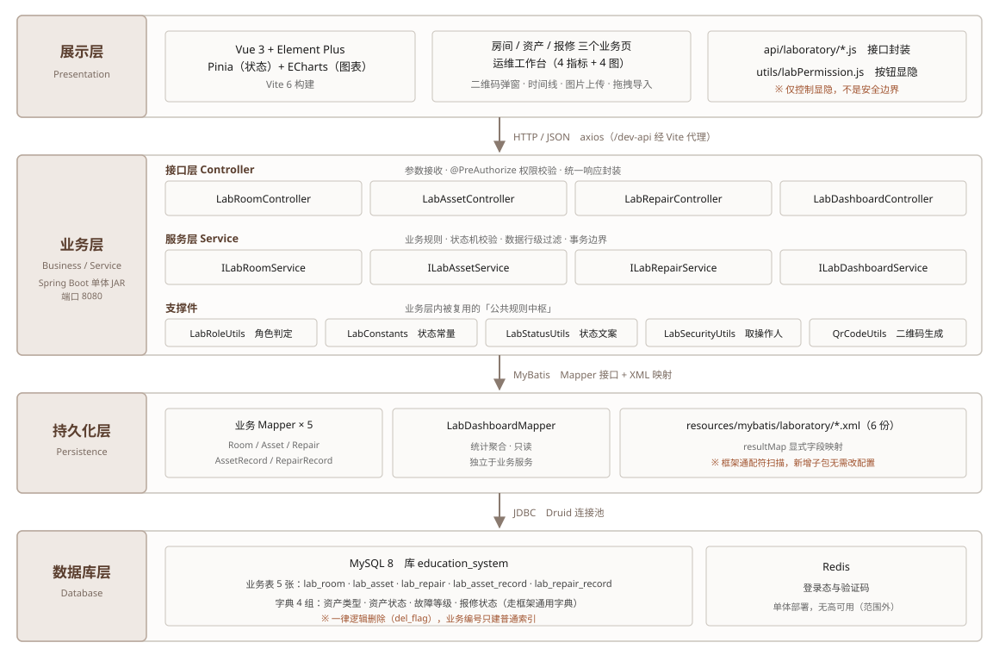
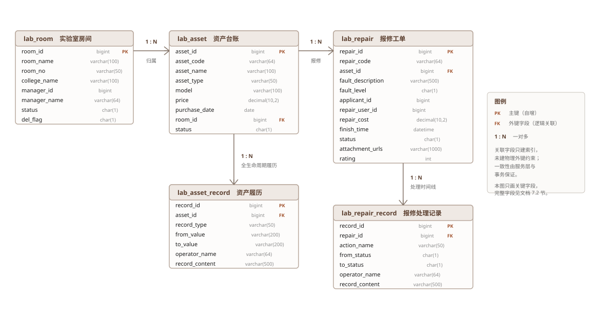

# 软件架构设计文档

> 本文件是**源稿**（Markdown）。定稿流程：AI 出初稿 → 人工改写表述（防查重）→ 回填 `[待填]` → 导出 PDF（须嵌入字体）。
> **封面字段一律照 `docs/大作业/封面署名信息.md` 填写**，不要从别处抄。

| 项目 | 内容 |
| --- | --- |
| 项目名称 | 高校实验室资产与报修管理平台 |
| 团队编号 | 第 6 组 |
| 团队成员 | 王旻辉、巴力江·托力肯别克、廖煌、迪丽热巴·阿布都西克尔 |
| 班级 / 学号 | 软件工程 2023-2 ／ 2311231056（其余 3 人学号 ____） |
| 二级学院 / 专业 | ____ |
| 授课教师 | 谭清萱 |
| 版本号 | V1.0 |
| 日期 | ____ |
| 编写人 / 审核人 | ____ ／ ____ |

**修订历史**

| 版本 | 日期 | 修订内容 | 修订人 |
| --- | --- | --- | --- |
| V0.1 | ____ | 初稿完成（AI 辅助生成；**设计模式类图留 `[待填]`，等 T5**；表结构已于 T0 落地后回填） | ____ |
| V1.0 | ____ | 人工改写表述、回填 `[待填]`、定稿 | ____ |

---

## 编写说明与 AI 使用声明

| 章节 | 生成方式 | 说明 |
| --- | --- | --- |
| 1 引言 | AI 生成初稿 → **待人工改写** | 技术栈与约束由项目公共记忆与代码事实转写 |
| 2 架构总览 | AI 生成初稿 → **待人工改写** | 分层与选型依据项目实际目录结构整理；**图 2-1 为 AI 手绘 SVG**（本机无绘图工具，源文件 `figures/layered-architecture.svg` 可改可重绘） |
| 3 分层架构详述 | AI 生成初稿 → **待人工改写** | 每层的核心组件清单**由代码检索得到**，非推测 |
| 4 SOLID 应用 | AI 生成初稿 → **待人工改写** | 4 处应用均**标注到具体类**；缺 LSP 的理由已照实说明 |
| 5 设计模式 | **仅骨架** | **T5 尚未落地**，选型未定稿，类图与代码结构留 `[待填]`，不代写 |
| 6 核心模块接口定义 | AI 生成初稿 → **待人工改写** | 方法签名**逐条从接口源文件摘录**，未增删 |
| 7 数据设计 | AI 生成初稿 → **待人工改写** | ER 关系来自 Mapper 的关联查询；**字段类型/长度/索引已按 T0 建表脚本（`sql/laboratory_schema.sql`）逐字回填**；**图 7-1 为 AI 手绘 SVG**（源文件 `figures/er-diagram.svg`） |
| 8 部署视图 | **仅骨架** | 生产与类生产环境依赖 T3/T4，未落地部分留 `[待填]` |
| 附录 A | AI 生成初稿 → **待人工改写** | 接口清单由控制器注解检索得到 |

> **防查重提示（提交前请删除本条）**：本稿的表述与项目内部文件（`README.md`、`AGENTS.md`、任务卡）存在同源风险，
> 定稿前必须由人工通读改写并做一次查重。
>
> **本稿的诚实性边界**：凡未经确认的内容一律标注 `[待填]` 并写明"等谁、等哪张卡"，**没有编造表结构、类图或性能数据**。

---

## 1 引言

### 1.1 编写目的

本文档描述系统的软件架构，说明各层的职责划分、关键设计决策及其理由，作为编码实现、测试设计与后续维护的技术依据。
与前一份《需求规格说明书》的分工是：需求文档回答"系统要做什么"，本文档回答"系统怎么搭起来、为什么这样搭"。

### 1.2 架构目标与约束

| 项 | 内容 |
| --- | --- |
| 架构风格 | **前后端分离的分层单体架构**（后端单体 JAR + 独立前端工程），非微服务 |
| 后端技术栈 | Spring Boot 2.5.15、Java 8、MyBatis、Druid、Redis、Quartz、Spring Security + JWT |
| 前端技术栈 | Vue 3.5、Vite 6、Element Plus 2.13、Pinia、ECharts 5.6 |
| 数据存储 | MySQL 8（业务库）、Redis（登录态与验证码） |
| 代码组织约束 | **自定义业务代码全部集中在 `com.ruoyi.project.laboratory` 包内**，不修改框架原生包 |
| 团队与工期约束 | 小组作业，**答辩日 2026-09-22**；可用开发窗口很短，因此**不做微服务拆分、不引入消息中间件、不做多租户** |
| 交付约束 | 必须可复现（从零建库跑起来）、必须有可运行测试、必须有 CI/CD 方案 |

**为什么选分层单体而不是微服务**：本系统由 4 个强关联的业务模块组成（房间 → 资产 → 报修 → 统计），
它们共享同一套权限与同一份数据；拆成微服务会引入分布式事务、服务发现与链路追踪的复杂度，
而**课程的评分维度（需求 / 架构 / 测试 / CI-CD / AI 实践）没有一个与"服务拆分数量"相关**。
在只有 5 天的交付窗口里，把复杂度花在一致性而不是拆分上，是明确的取舍。

### 1.3 术语

| 术语 | 说明 |
| --- | --- |
| 分层架构 | 按职责把系统纵向切成若干层，每层只依赖相邻下层 |
| DTO / VO | 数据传输对象 / 视图对象（本项目以若依原生风格为主，未强制区分） |
| 行级数据过滤 | 在服务层按当前用户角色收窄查询范围，而非仅在接口层拦权限 |
| 逻辑删除 | 删除只置标记位，记录保留 |
| 多租户 | 一套系统服务多个互相隔离的组织（**本项目明确不做**） |

---

## 2 架构总览

### 2.1 分层架构图

> **图源说明**：矢量源文件为 `figures/layered-architecture.svg`，答辩 PPT 第 3 页可直接引用或按同一版式重绘，
> **不要用代码截图**。层与层之间是**单向依赖**：展示层 → 业务层 → 持久化层 → 数据库层，不出现反向依赖。

**逐层职责一句话概括**

| 层 | 一句话职责 | 不该出现在这一层的东西 |
| --- | --- | --- |
| 展示层 | 呈现数据、收集输入、按权限**显隐**操作入口 | 业务规则（如"资产维修中不能删"）不写在前端 |
| 业务层 | 业务规则、状态机校验、事务编排、数据行级过滤 | 不写 SQL、不拼表名 |
| 持久化层 | 屏蔽 SQL 细节，提供面向对象的查询与写入 | 不做业务判断 |
| 数据库层 | 持久化、关联完整性、聚合统计的数据来源 | 不承载业务语义（状态码含义由代码定义） |

### 2.2 层间依赖规则

1. **单向依赖**：展示层 → 业务层 → 持久化层 → 数据库层，**不出现反向依赖**；
2. **接口与实现分离**：控制器只依赖 `ILabXxxService` 接口，不依赖实现类；
3. **业务规则不进控制器**：控制器只做参数与权限，状态机校验、唯一性校验、事务编排都在服务层；
4. **统计查询不进业务服务**：看板的聚合查询独立成 `ILabDashboardService` + 独立 Mapper，不污染业务服务。

---

## 3 分层架构详述

### 3.1 展示层（Presentation Layer）

| 项目 | 说明 |
| --- | --- |
| 职责 | 呈现数据、收集用户输入、按权限显隐操作入口；**不承载业务规则** |
| 核心组件 | `views/laboratory/room/index.vue`、`asset/index.vue`、`repair/index.vue`、`views/index.vue`（运维工作台） |
| 辅助模块 | `api/laboratory/*.js`（接口封装）、`utils/labPermission.js`（角色判定）、字典翻译（`useDict`） |
| 技术实现 | Vue 3 组合式 API + Element Plus 组件；图表用 ECharts；状态用 Pinia；构建 Vite 6 |
| 关键交互 | 二维码弹窗（资产标签）、`el-timeline`（资产履历与报修处理时间线）、图片上传（报修附件，最多 4 张 / 单张 5 MB）、`el-upload` 拖拽导入资产 |

**前端的一个明确设计选择**：前端的角色判定（`labPermission.js`）**只用于控制按钮显隐**，
它**不是安全边界**——真正的拒绝发生在后端的接口注解与服务层行级过滤上。
二者必须同源，因此两侧的角色判定口径都收敛到"单一来源"的做法（见 4.2 的 OCP 条目）。

### 3.2 业务层（Business Layer）

业务层分为**接口层**与**服务层**两段。

**接口层（Controller）：四个控制器，共 28 个端点**

| 控制器 | 基础路径 | 端点数 | 覆盖能力 |
| --- | --- | :-: | --- |
| `LabRoomController` | `/laboratory/room` | 6 | 房间列表、导出、详情、新增、修改、删除（含删除前校验） |
| `LabAssetController` | `/laboratory/asset` | 11 | 台账列表、可报修资产、导出、批量导入、导入模板、详情、二维码、履历、新增、修改、删除 |
| `LabRepairController` | `/laboratory/repair` | 9 | 工单列表、导出、详情、处理记录、提交、修改、审核、评价、删除 |
| `LabDashboardController` | `/laboratory/dashboard` | 2 | 指标汇总、图表数据 |

**服务层（Service）：四个业务接口 + 其实现**

| 接口 | 实现类 | 职责 |
| --- | --- | --- |
| `ILabRoomService` | `LabRoomServiceImpl` | 房间 CRUD、编号唯一性、删除前置校验（房间下是否仍有资产） |
| `ILabAssetService` | `LabAssetServiceImpl` | 资产 CRUD、编号唯一性、Excel 导入导出、二维码生成、履历查询与写入 |
| `ILabRepairService` | `LabRepairServiceImpl` | 工单提交/审核/流转/评价、**状态机校验**、资产状态联动、履历写入 |
| `ILabDashboardService` | `LabDashboardServiceImpl` | 指标与图表聚合；**只读**，不改任何业务数据 |

**支撑件（业务层的"公共规则中枢"）**

| 类 | 职责 | 为什么值得单列 |
| --- | --- | --- |
| `LabConstants` | 状态码常量（删除标记 / 房间状态 / 资产状态 / 报修状态） | 把散落的字面量 `"0"`/`"2"` 收敛为具名常量，改状态语义时只有一个落点 |
| `LabRoleUtils` | 角色判定唯一来源：可处理报修的角色集合、可查看全部数据的角色集合 | 权限口径一旦分叉就会出现"按钮可见但接口 403"（历史上真实发生过，见下文 4.2） |
| `LabStatusUtils` | 状态码 → 中文文案 | 避免前后端各写一套翻译 |
| `LabSecurityUtils` | 取当前操作用户，缺失时兜底 | 履历记录需要可靠的操作人字段 |
| `QrCodeUtils` | 资产二维码 SVG 生成 | 与业务解耦的纯工具 |

**事务边界**：写操作集中在服务层，跨表写入（报修单 + 资产状态 + 履历流水）在同一事务内完成；
非法状态流转由服务层直接抛业务异常，**不依赖前端限制**。

### 3.3 持久化层（Persistence Layer）

| 项目 | 说明 |
| --- | --- |
| 职责 | 屏蔽 SQL 细节，向服务层提供面向对象的查询与写入方法 |
| 核心组件 | `LabRoomMapper`、`LabAssetMapper`、`LabRepairMapper`、`LabAssetRecordMapper`、`LabRepairRecordMapper`、`LabDashboardMapper` |
| 映射资源 | `resources/mybatis/laboratory/*.xml`（6 份） |
| 技术实现 | MyBatis；`resultMap` 显式声明字段映射 |
| 配置特点 | 框架使用**通配符扫描**（`com.ruoyi.project.**.domain`、`classpath*:mybatis/**/*Mapper.xml`），**新增业务子包无需改动任何配置**——这是"业务与框架隔离"的落地保障 |

**列表查询的统一约束**：所有面向业务的列表查询都必须带逻辑删除条件（`del_flag = '0'`），
否则已删除数据会重新出现在界面上。该约束是业务规则 BR-06 的架构侧体现。

### 3.4 数据库层（Database Layer）

| 项目 | 说明 |
| --- | --- |
| 职责 | 数据持久化、关联完整性、聚合统计的数据来源 |
| 核心组件 | MySQL 8（库 `education_system`）、Redis（登录态与验证码） |
| 业务表 | `lab_room`、`lab_asset`、`lab_repair`、`lab_asset_record`、`lab_repair_record` 五张 |
| 字典表 | `lab_asset_type`、`lab_asset_status`、`lab_fault_level`、`lab_repair_status` 四组（走框架通用字典机制） |
| 删除策略 | **一律逻辑删除**，不做物理删除；记录保留以便追溯 |
| 建表脚本 | `sql/laboratory_schema.sql`（`[1/7]`）已补齐五张业务表 DDL，**空库可完整重建**；字符集显式写死 `utf8mb4 / utf8mb4_general_ci`；字段类型/长度与线上库对齐，索引按设计意图另建（见 7.2 与附录 B） |

### 3.5 跨层关注点

| 关注点 | 落地方式 |
| --- | --- |
| **认证** | Spring Security + JWT；令牌放在请求头；有效期 30 分钟；无状态 |
| **授权（接口级）** | 控制器方法上的权限注解，权限标识形如 `laboratory:{模块}:{操作}`；看板使用独立权限标识 |
| **授权（数据级）** | 服务层按角色收窄查询范围：不可查看全部数据的角色，列表与详情被强制过滤为"本人提交" |
| **口令安全** | BCrypt 哈希存储，不存明文 |
| **异常与提示** | 业务校验失败抛业务异常并带明确中文原因（如"资产维修中，不能删除"），由框架统一转换为响应 |
| **操作留痕** | 关键写操作记操作日志；业务侧另有履历流水表（资产履历 / 报修处理记录），二者互补 |
| **配置外置** | 数据库、Redis、令牌密钥支持环境变量覆盖，避免把口令写进配置文件 |

---

## 4 SOLID 原则应用

### 4.1 应用位置一览（**均已标注到具体类**）

| 原则 | 应用位置（类 / 模块） | 具体说明 |
| --- | --- | --- |
| **S｜单一职责 SRP** | `LabRepairServiceImpl`、`LabRoleUtils` | 前者只负责报修业务本身的规则与流程编排；需要改变资产状态时**委托** `ILabAssetService.updateLabAsset()`，**不直接操作资产表**，所以"资产状态怎么改、改完记什么履历"始终只有一处实现。后者只负责"当前用户能做什么"这一件事，里面没有一行业务分支。两个类各自只有一个引起变化的原因——这就是单一职责的判据 |
| **O｜开放封闭 OCP** | `LabRoleUtils` + `LabConstants` | 角色白名单与状态码集合都是**集中的常量/集合**。新增一个角色时只改 `LabRoleUtils` 里的集合，**所有调用方零改动**；同理新增一个资产状态只改 `LabConstants` |
| **I｜接口隔离 ISP** | `ILabRoomService` / `ILabAssetService` / `ILabRepairService` / `ILabDashboardService` | **刻意没有**合并成一个"实验室服务"胖接口。房间管理员、资产管理员、维修人员需要的操作完全不同，拆开后每个服务只暴露自己领域的方法，控制器也不会被迫依赖用不到的方法 |
| **D｜依赖倒置 DIP** | 全部控制器 → `ILabXxxService` → `LabXxxServiceImpl` | 控制器依赖**接口**而非实现类，因此可以替换实现、可以注入测试替身做单元测试；现有单元测试正是靠这一点在不起 Spring 容器的前提下验证状态机规则 |

### 4.2 关于 LSP（里氏替换）的说明

本项目**没有建立业务类的继承体系**——四个业务服务之间是并列关系，不存在"子类替换父类"的场景，
因此**不适用里氏替换原则**，也不为凑够条目而虚构一条继承关系。
反过来说，真正需要"可替换"的地方（控制器眼中的服务、服务眼中的 Mapper）**用的是接口而非继承**，
这属于 DIP 与 ISP 的适用范围。

### 4.3 一次由"违反单一来源"引发的真实缺陷（架构层面的教训）

系统的角色判定原本分散在**四个地方**：后端控制器权限注解、数据库菜单授权脚本、
前端按钮权限指令、服务层的行级过滤。其中"资产管理员"这个角色在后端角色工具类里属于"可查看全部数据"，
但菜单授权脚本是按"是否持有报修列表权限"来授权的——两处口径不一致，
导致**资产管理员登录后首页看板必然被拒绝访问**。

修复方式不是补一处判断，而是**把角色口径收敛为唯一来源**（`LabRoleUtils` 的两个角色集合），
并要求与之相关的授权脚本末尾按同一份清单兜底。这条教训直接支撑了上表中 OCP 的做法：
**"同一件事有三个落点"是缺陷的温床，而不是灵活性。**

---

## 5 设计模式

> ⚠️ **本章为骨架，等待 T5 落地后回填。**
> 依据 `AGENTS.md` 第 6 节，T5（设计模式落地）当前状态为**未开始**；
> 因此**本节不提供类图与代码结构**——那会在实现落地后与真实代码对不上。

### 5.1 选型（方向已定，细节待落地）

| 项目 | 内容 |
| --- | --- |
| 选用模式类型 | **创建型 — 简单工厂** |
| 候选场景 | 资产履历与报修处理记录这两类"流水记录"的构造：字段结构相似、按记录类型区分语义 |
| 解决的问题 | 避免在服务层出现"按类型分别 new 不同对象并逐字段赋值"的重复分支代码，把"对象的构造"与"对象的使用"分开 |
| 落地后需回填 | 类图、工厂类的关键代码结构、工厂方法签名、**在架构文档中可指向的具体类名** |
| 状态 | `[待填]`（等 T5 卡完成；文责归「代码负责」） |

### 5.2 简化类图

`[待填]` —— 等 T5 落地后按真实类名绘制（本稿**不预画**，避免类图与代码不一致）。

### 5.3 关键代码结构（伪代码）

`[待填]` —— 同上。

### 5.4 明确不使用的模式及理由

| 未采用的模式 | 不采用的理由 |
| --- | --- |
| **状态模式（State）** | 报修状态流转当前只有 3 个分支的判断，引入状态模式需要新增 5 个状态类与上下文对象，**属于过度设计**——代码可读性反而下降。这是**主动做出的技术判断**，答辩时按此说明。 |
| **观察者 / 事件驱动** | 资产状态联动的触发点只有 3 处且都在同一事务内，用消息或事件会引入一致性问题与额外运维成本。 |

---

## 6 核心模块接口定义

以下签名**逐条摘自接口源文件**，用于体现信息隐藏：控制器与外部只需知道"能做什么"，
不需要知道"内部如何实现"（例如 `ILabAssetService` 不暴露任何 SQL 或表结构信息）。

### 6.1 `ILabRoomService`（房间服务）

| 方法签名 | 说明 |
| --- | --- |
| `LabRoom selectLabRoomByRoomId(Long roomId)` | 按主键取房间 |
| `List<LabRoom> selectLabRoomList(LabRoom labRoom)` | 条件查询房间列表（自动过滤已删除） |
| `int insertLabRoom(LabRoom labRoom)` | 新增房间（含编号唯一性校验） |
| `int updateLabRoom(LabRoom labRoom)` | 修改房间（部分字段更新时只校验被改字段） |
| `boolean checkRoomNoUnique(LabRoom labRoom)` | 房间编号唯一性校验（更新时排除自身） |
| `int deleteLabRoomByRoomId(Long roomId)` | 删除单个房间（房间下仍有资产则拒绝） |
| `int deleteLabRoomByRoomIds(Long[] roomIds)` | 批量删除（逐条走同一前置校验） |

### 6.2 `ILabAssetService`（资产服务）

| 方法签名 | 说明 |
| --- | --- |
| `LabAsset selectLabAssetByAssetId(Long assetId)` | 按主键取资产（含所属房间名） |
| `List<LabAsset> selectLabAssetList(LabAsset labAsset)` | 台账条件查询 |
| `List<LabAsset> selectRepairableAssetList(LabAsset labAsset)` | 取"当前可报修"的资产（供报修表单选择） |
| `int insertLabAsset(LabAsset labAsset)` | 新增资产（含编号唯一性校验 + 写入入库履历） |
| `int updateLabAsset(LabAsset labAsset)` | 修改资产（供本服务与报修服务共用） |
| `boolean checkAssetCodeUnique(LabAsset labAsset)` | 资产编号唯一性校验（更新时排除自身） |
| `String importLabAsset(List<LabAsset> assetList, String operName)` | 批量导入，返回成功/失败汇总 |
| `Map<String, Object> buildAssetQrcode(Long assetId)` | 生成资产二维码（返回可渲染的图形数据） |
| `List<LabAssetRecord> selectLabAssetRecords(Long assetId)` | 资产全生命周期履历 |
| `int deleteLabAssetByAssetId(Long assetId)` | 删除单个资产（维修中的资产拒绝删除） |
| `int deleteLabAssetByAssetIds(Long[] assetIds)` | 批量删除 |

### 6.3 `ILabRepairService`（报修服务）

| 方法签名 | 说明 |
| --- | --- |
| `LabRepair selectLabRepairByRepairId(Long repairId)` | 按主键取工单（含资产与房间信息） |
| `List<LabRepair> selectLabRepairList(LabRepair labRepair)` | 工单列表（**含行级数据过滤**） |
| `int insertLabRepair(LabRepair labRepair)` | 提交报修（校验资产可报修 → 置资产为维修中 → 写履历，同一事务） |
| `int updateLabRepair(LabRepair labRepair)` | 修改工单（含状态流转校验；非管理角色不允许更换报修资产） |
| `int auditLabRepair(LabRepair labRepair)` | 审核（通过 / 拒绝；拒绝时恢复资产状态） |
| `int evaluateLabRepair(LabRepair labRepair)` | 维修评价（限已完成工单、限申请人本人、评分 1~5） |
| `List<LabRepairRecord> selectLabRepairRecords(Long repairId)` | 工单处理时间线 |
| `int deleteLabRepairByRepairId(Long repairId)` | 逻辑删除单张工单 |
| `int deleteLabRepairByRepairIds(Long[] repairIds)` | 批量逻辑删除 |

### 6.4 `ILabDashboardService`（看板服务）

| 方法签名 | 说明 |
| --- | --- |
| `Map<String, Object> selectSummary()` | 取 4 项指标卡数据（资产总数、维修中、待处理工单、本月完成数等；实际口径以服务实现为准） |
| `Map<String, Object> selectCharts()` | 取 4 张 ECharts 图的系列数据 |

> 该接口只有两个方法且返回结构化的键值对，**刻意保持"薄"**：统计口径的任何调整都只发生在实现类内，
> 控制器与前端不需要同步改动（这是 ISP 在本项目的直观体现）。

### 6.5 信息隐藏的体现

1. 资产状态如何随报修变化、履历写了哪些字段——**对外不可见**，只暴露"提交报修"这一个动作；
2. 二维码的生成算法（SVG 绘制细节）被封在工具类内，接口只返回可直接渲染的数据；
3. 统计口径（哪几个指标是全局、哪几个按申请人过滤）由看板服务内部决定，控制器不参与计算。

---

## 7 数据设计

### 7.1 实体关系图

关系来自持久层的**关联查询实证**（资产按房间关联、报修按资产与房间关联、两类履历按各自主表关联）。
下图字段类型已按 **T0 产出的建表脚本 `sql/laboratory_schema.sql` 逐字回填**（2026-09-17），不再是从字段名猜的示意值。

> 图中只画**关键字段**（为版面清晰，`create_by` / `create_time` / `update_by` / `update_time` / `remark`
> 等通用审计字段与部分评价字段未画出），**完整字段与长度见 7.2**；三张主表的关联字段
> （`lab_asset.room_name`、`lab_repair.asset_name` / `asset_code` / `room_name`）来自 SQL 联表，**不是物理列**，故不入图。

### 7.2 核心数据表结构

> 下列字段名、类型、长度、默认值与索引**逐字回填自 T0 产出的建表脚本 `sql/laboratory_schema.sql`**（2026-09-17 完成）。
> 该脚本的基准是：**字段类型 / 长度 / 默认值以线上库为准，索引策略以设计意图为准**，并对 6 处与线上库的
> **有意差异**逐条作了说明；其中"不建唯一索引"一条属**架构级决策**，已收入附录 B。
> 全部表 `engine=innodb`、`charset=utf8mb4`、`collate=utf8mb4_general_ci`（字符集显式写死，避免 MySQL 8 默认 collation 不一致）。

**`lab_room`（实验室房间）— 13 个字段**

| 字段 | 类型 / 约束 |
| --- | --- |
| `room_id` | `bigint(20)`，主键、自增 |
| `room_name` | `varchar(100)` 非空 |
| `room_no` | `varchar(50)` 非空（房间号，如"信工楼 A301"；**唯一性由应用层校验**） |
| `college_name` | `varchar(100)`（所属学院） |
| `manager_id` / `manager_name` | `bigint(20)`（关联 `sys_user.user_id`） / `varchar(64)`（冗余姓名，避免列表页再关联用户表） |
| `status` | `char(1)` 默认 `'0'`（`0` 正常 / `1` 停用） |
| `del_flag` | `char(1)` 默认 `'0'`（`0` 存在 / `2` 删除） |
| 通用审计字段：`create_by` `create_time` `update_by` `update_time` `remark` | `varchar(64)`／`datetime`／`varchar(64)`／`datetime`／`varchar(500)` |

主键 `room_id`；索引 `idx_lab_room_no(room_no)`（房间编号是列表页高频查询路径）。

**`lab_asset`（资产台账）— 15 个自有字段**（另有 1 个关联字段 `room_name` 来自 `lab_room`，不落库）

| 字段 | 类型 / 约束 |
| --- | --- |
| `asset_id` | `bigint(20)`，主键、自增 |
| `asset_code` / `asset_name` | `varchar(64)` 非空（高校固定资产号，**唯一性由应用层校验**） / `varchar(100)` 非空 |
| `asset_type` | `varchar(50)`（字典 `lab_asset_type`） |
| `model` | `varchar(100)`（规格型号） |
| `price` / `purchase_date` | `decimal(10,2)` 默认 `'0.00'` / `date` |
| `room_id` | `bigint(20)`（关联 `lab_room.room_id`，**可空**：兼容"先入库、后归属房间"） |
| `status` | `char(1)` 默认 `'0'`（`0` 正常 / `1` 停用 / `2` 维修中，见 `LabConstants` 的 `ASSET_STATUS_*`） |
| `del_flag` | `char(1)` 默认 `'0'`（逻辑删除标记） |
| 通用审计字段：`create_by` `create_time` `update_by` `update_time` `remark` | `varchar(64)`／`datetime`／`varchar(64)`／`datetime`／`varchar(500)` |

主键 `asset_id`；索引 `idx_lab_asset_code(asset_code)`、`idx_lab_asset_room_id(room_id)`、`idx_lab_asset_status(status)`。
**注意：`asset_code` 建的是普通索引而非唯一索引**——理由见附录 B（与逻辑删除的冲突）。

**`lab_repair`（报修工单）— 23 个自有字段**（另有 3 个关联字段 `asset_name` / `asset_code` / `room_name` 来自资产与房间表）

| 字段 | 类型 / 约束 |
| --- | --- |
| `repair_id` | `bigint(20)`，主键、自增 |
| `repair_code` | `varchar(64)` 非空（业务自动生成的单号；**普通索引**，理由同 `asset_code`） |
| `asset_id` | `bigint(20)` 非空（关联 `lab_asset.asset_id`，**新增时选定后不可更换**） |
| `fault_description` | `varchar(500)` 非空（故障描述） |
| `fault_level` | `char(1)` 默认 `'1'`（字典 `lab_fault_level`） |
| `applicant_id` / `applicant_name` / `applicant_phone` | `bigint(20)`（关联 `sys_user.user_id`） / `varchar(64)` / `varchar(20)` |
| `repair_user_id` / `repair_user_name` | `bigint(20)` / `varchar(64)`（维修人） |
| `repair_cost` / `finish_time` | `decimal(10,2)` 默认 `'0.00'`（维修成本） / `datetime`（完成时间） |
| `status` | `char(1)` 默认 `'0'`（`0` 待审核 / `1` 待维修 / `2` 维修中 / `3` 已完成 / `4` 已拒绝） |
| `attachment_urls` | `varchar(1000)`（故障图片，多张以逗号分隔，最多 4 张） |
| `rating` / `evaluation_content` / `evaluation_time` | `int`（评分 `1`~`5`） / `varchar(500)` / `datetime` |
| `del_flag` | `char(1)` 默认 `'0'`（逻辑删除标记） |
| 通用审计字段：`create_by` `create_time` `update_by` `update_time` `remark` | `varchar(64)`／`datetime`／`varchar(64)`／`datetime`／`varchar(500)` |

主键 `repair_id`；索引 `idx_lab_repair_code`、`idx_lab_repair_asset_id`、`idx_lab_repair_applicant_id`、`idx_lab_repair_status`。
其中 `idx_lab_repair_applicant_id` 专为**服务层的行级过滤**（"只看本人提交"）服务；`repair_code` 同为普通索引（理由同 `asset_code`）。

**`lab_asset_record`（资产履历）— 10 个字段**

| 字段 | 类型 / 约束 |
| --- | --- |
| `record_id` | `bigint(20)`，主键、自增 |
| `asset_id` | `bigint(20)` 非空（所属资产） |
| `record_type` | `varchar(50)` 非空（入库 / 状态变更 / 调拨等） |
| `from_value` / `to_value` | `varchar(200)`（变更前／变更后取值） |
| `operator_name` / `record_content` | `varchar(64)` 默认 `''`（操作人） / `varchar(500)` 默认 `''`（记录内容） |
| 通用审计字段：`create_by` `create_time` `remark` | `varchar(64)`／`datetime`／`varchar(500)` |

主键 `record_id`；索引 `idx_asset_record_asset_id(asset_id)`（履历按资产查时间线）。

**`lab_repair_record`（报修处理记录）— 10 个字段**

| 字段 | 类型 / 约束 |
| --- | --- |
| `record_id` | `bigint(20)`，主键、自增 |
| `repair_id` | `bigint(20)` 非空（所属工单） |
| `action_name` | `varchar(50)` 非空（提交、审核、流转等） |
| `from_status` / `to_status` | `char(1)`（流转前／后状态） |
| `operator_name` / `record_content` | `varchar(64)` 默认 `''`（操作人） / `varchar(500)` 默认 `''`（记录内容） |
| 通用审计字段：`create_by` `create_time` `remark` | `varchar(64)`／`datetime`／`varchar(500)` |

主键 `record_id`；索引 `idx_repair_record_repair_id(repair_id)`（处理时间线按工单查）。

> 两张记录表的字段与 `sql/laboratory_upgrade.sql` **刻意保持完全一致**（连索引名都不改），
> 因为后者用存储过程按"列是否存在"做幂等 `alter`；两边定义若不一致，会出现"检测到列已存在→跳过→实际缺列"的静默故障。

**字典（4 组）**：`lab_asset_type`（资产类型）、`lab_asset_status`（资产状态）、
`lab_fault_level`（故障等级）、`lab_repair_status`（报修状态）；均走框架通用字典机制，前端统一翻译。

### 7.3 数据设计中的三条硬约束

1. **逻辑删除贯穿全链路**：删除只置标记位（`del_flag='2'`），列表查询必须带正常标记条件（`del_flag='0'`）；
2. **状态取值只有一个定义处**：资产与报修的状态码由 `LabConstants` 统一定义，字典与前端展示都以它为准。
   **数据库注释、字典数据、代码常量三者必须一致**——本项目线上库的 `lab_asset.status` 注释曾写成
   历史文本"0在用 1闲置 2报修中 3报废"，与代码和字典都对不上；T0 的建表脚本已**采用代码口径**统一（属已修复项）；
3. **唯一性只能由应用层保证，不能交给数据库唯一索引**：本系统一律逻辑删除、行不消失，
   而唯一性校验带 `del_flag='0'` 条件（即"编号可重用"）。若同时建数据库唯一索引，
   就会出现"资产 A 删除 → 重建同编号 A → 应用层放行 → 数据库拒绝 → 接口 500"。
   因此 `asset_code` / `repair_code` / `room_no` **一律只建普通索引**，唯一性由服务层的
   `checkAssetCodeUnique` / `checkRoomNoUnique` 承担（见附录 B）。

---

## 8 部署视图

> ⚠️ 生产与类生产环境依赖 **T3（流水线 / 部署策略）** 与 **T4（容器化）**，两者尚未落地，本节的对应行留 `[待填]`。

| 环境 | 用途 | 部署方式 | 状态 |
| --- | --- | --- | --- |
| 开发环境 | 本地开发与联调 | 后端以 Spring Boot 单体启动（端口 8080）；前端 Vite 开发服务器（端口 80），经代理转发接口；MySQL 8 与 Redis 本地启动 | ✅ 已在用（事实） |
| 类生产环境 | 集成验证与演示 | `[待填]` —— 等 T3 | ⏳ |
| 生产环境 | 正式对外 | `[待填]` —— 等 T3 / T4（容器化与反向代理方案） | ⏳ |

**配置外置（已实现的事实）**：数据库地址与口令、Redis 口令、令牌密钥均支持环境变量覆盖，
配置文件里不写死生产口令。**当前已知需改进项**：令牌签名密钥存在默认弱值，生产部署必须用环境变量覆盖
（该条已列入《CI/CD 部署方案》的配置差异章节）。

---

## 附录 A　接口清单（28 个端点）

> 由控制器注解检索得到，用于证明架构文档描述的接口**真实存在**。

| 模块 | 方法与路径 | 权限标识 |
| --- | --- | --- |
| 房间 | `GET /laboratory/room/list` | `laboratory:room:list` |
| 房间 | `POST /laboratory/room/export` | `laboratory:room:export` |
| 房间 | `GET /laboratory/room/{roomId}` | `laboratory:room:query` |
| 房间 | `POST /laboratory/room` | `laboratory:room:add` |
| 房间 | `PUT /laboratory/room` | `laboratory:room:edit` |
| 房间 | `DELETE /laboratory/room/{roomIds}` | `laboratory:room:remove` |
| 资产 | `GET /laboratory/asset/list` | `laboratory:asset:list` |
| 资产 | `GET /laboratory/asset/repairable` | `laboratory:asset:query` |
| 资产 | `POST /laboratory/asset/export` | `laboratory:asset:export` |
| 资产 | `POST /laboratory/asset/importData` | `laboratory:asset:import` |
| 资产 | `POST /laboratory/asset/importTemplate` | `laboratory:asset:import` |
| 资产 | `GET /laboratory/asset/{assetId}` | `laboratory:asset:query` |
| 资产 | `GET /laboratory/asset/{assetId}/qrcode` | `laboratory:asset:query` |
| 资产 | `GET /laboratory/asset/{assetId}/records` | `laboratory:asset:query` |
| 资产 | `POST /laboratory/asset` | `laboratory:asset:add` |
| 资产 | `PUT /laboratory/asset` | `laboratory:asset:edit` |
| 资产 | `DELETE /laboratory/asset/{assetIds}` | `laboratory:asset:remove` |
| 报修 | `GET /laboratory/repair/list` | `laboratory:repair:list` |
| 报修 | `POST /laboratory/repair/export` | `laboratory:repair:export` |
| 报修 | `GET /laboratory/repair/{repairId}` | `laboratory:repair:query` |
| 报修 | `GET /laboratory/repair/{repairId}/records` | `laboratory:repair:query` |
| 报修 | `POST /laboratory/repair` | `laboratory:repair:add` |
| 报修 | `PUT /laboratory/repair` | `laboratory:repair:edit` |
| 报修 | `PUT /laboratory/repair/audit` | `laboratory:repair:audit` |
| 报修 | `PUT /laboratory/repair/evaluate` | `laboratory:repair:evaluate` |
| 报修 | `DELETE /laboratory/repair/{repairIds}` | `laboratory:repair:remove` |
| 看板 | `GET /laboratory/dashboard/summary` | `laboratory:dashboard:view` |
| 看板 | `GET /laboratory/dashboard/charts` | `laboratory:dashboard:view` |

---

## 附录 B　关键设计决策与明确不做的部分

| 决策 | 选择 | 理由 |
| --- | --- | --- |
| 架构风格 | 分层单体 | 4 个模块共享数据与权限，微服务的复杂度换不回任何评分收益 |
| 业务代码位置 | 独立业务包 | 与框架原生包隔离，升级框架时冲突面最小；框架侧用通配符扫描，新增子包零配置 |
| 前端角色判定 | 只做显隐，不做安全边界 | 真正的拒绝在后端；避免"前端拦住了就当安全"的错觉 |
| 资产状态联动 | 由报修服务**委托**资产服务完成 | 资产状态的唯一写入口，避免两处改同一张表 |
| 主表字段类型 / 长度 | **以线上库为准**（T0 建表脚本照抄线上库） | 建表脚本、线上库、迁移脚本三方 schema 必须一致；不一致时幂等 `alter` 会"检测到列已存在→跳过"，留下静默缺列 |
| 业务编号的索引类型 | **只建普通索引，不建唯一索引** | 逻辑删除下唯一索引与"编号可重用"直接冲突：删了资产就建不回同编号（详见 7.3 第 3 条）。唯一性交给服务层校验 |
| 字符集与排序规则 | **显式写死** `utf8mb4` / `utf8mb4_general_ci` | MySQL 8 默认排序规则是 `utf8mb4_0900_ai_ci`，不写死会与线上库不一致，联表比较时可能报错 |
| **不做** 房间/设备预约 | 范围外 | 属另一选题方向的延伸能力，本期不新增模块 |
| **不做** 移动端原生 App / 小程序 | 范围外 | 前端已做响应式；与课程 5 个评分维度均不相关 |
| **不做** 多租户 / 多校区隔离 | 范围外 | 单校区场景，投入产出不划算 |
| **不做** 端到端自动化（Selenium） | 用集成测试 + 手工黑盒用例覆盖 | 说明见《测试计划与用例文档》的测试金字塔章节 |
| **不做** 状态模式重构 | 过度设计 | 现流转仅 3 个分支，重构后新增 5 个类而可读性下降 |

---

*本文件为《软件架构设计文档》源稿；表结构已按 T0 落地回填，第 5 章仍待 T5、第 8 章类生产/生产环境仍待 T3 / T4。*
