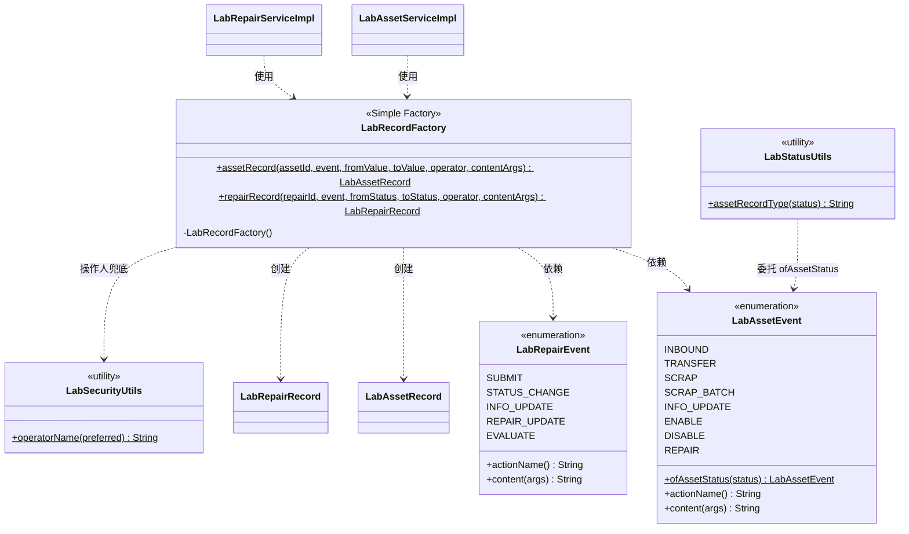

# 设计模式落地说明与类图（简单工厂）

> 本文件是《软件架构设计文档》第 5 章「设计模式」的**素材源**，由 T5 任务卡产出。
> 代码位置：`RuoYi-Vue-fast/src/main/java/com/ruoyi/project/laboratory/`
> 模式：**简单工厂（Simple Factory）**，属**创建型**模式。

---

## 1. 选型：为什么是它

任务书要求「至少使用 1 种创建型或结构型模式，画出简化类图」。这里没有为了凑分硬塞模式，而是先找系统里**真实存在的重复与扩展性问题**，再用模式解决它。

### 1.1 真实问题：履历对象的构造规则散落在两个 Service 的 10 个调用点上

系统有两条业务流水线 —— 资产履历（`lab_asset_record`）与报修履历（`lab_repair_record`）。它们的记录对象原先由两个 Service 各自手工 `new` 出来，每次都要做同样四件事：

| 要做的事 | 改前的做法 |
| --- | --- |
| 关联主键 | 手工 `setAssetId(...)` / `setRepairId(...)` |
| 动作名 | 手工写字面量：`"入库"`、`"报废"`、`"状态流转"`…… |
| 履历文案 | 手工拼字符串：`"资产入库：" + name`、`"报修状态由“" + a + "”变更为“" + b + "”"` |
| 操作人兜底 | 手工调 `LabSecurityUtils.operatorName(...)`，再把同一个值写进 `operator_name` 与 `create_by` |

调用点分布：

| 位置 | 调用点数 | 涉及的事件 |
| --- | --- | --- |
| `LabAssetServiceImpl` | **6** | 入库、调拨、报废（单条）、报废（批量）、资料修改、状态变更 |
| `LabRepairServiceImpl` | **4** 处语句 / **5** 个事件分支 | 提交报修、状态流转、维修信息更新、报修信息更新、维修评价 |

### 1.2 三个真实后果

1. **文案格式靠人工保证一致。** `报修状态由“X”变更为“Y”` 这类模板要改措辞，得同时改多处，很容易漏；而漏了的那条只会在生产库的履历里"变形"，测试未必报警。
2. **新增一种履历事件必须改调用方。** 以后要加「资产盘点」「设备借出」，得同时改 Service 并新增一堆字符串 —— **违反开闭原则（OCP）**。
3. **操作人兜底与 `createBy` 赋值在每处重复。** 漏写一处，产出的就是一条操作人为空的脏履历，且没有报错。

---

## 2. 类图



**读图要点**

- `LabRecordFactory` 是**唯一**知道「一次业务事件如何变成一条履历对象」的地方（`..>` 为依赖、`创建` 为产出关系）。
- 两个 Service 只**声明发生了什么事件**，不再自己拼对象、拼文案。
- 动作名与文案模板**不在工厂里写死**，而是由事件枚举提供 —— 工厂只做组装，枚举才承载文案，职责不混。
- `LabStatusUtils.assetRecordType` 退化为 `LabAssetEvent.ofAssetStatus` 的薄封装：「资产状态码 → 动作名」的判定规则由此**只有一张表**，字典口径与履历写入不会再各自漂移。

---

## 3. 落地清单

### 3.1 新增

| 文件 | 职责 |
| --- | --- |
| `constant/LabAssetEvent.java` | 8 个资产履历事件常量；每个常量自带动作名与文案模板；另提供状态码 → 事件的反查 `ofAssetStatus` |
| `constant/LabRepairEvent.java` | 5 个报修履历事件常量；同上 |
| `constant/LabRecordFactory.java` | 简单工厂。两个静态方法把「事件 + 前后值 + 操作人」组装成记录对象 |

### 3.2 改造

| 文件 | 改了什么 |
| --- | --- |
| `service/impl/LabAssetServiceImpl.java` | 6 个调用点改为声明 `LabAssetEvent`；`insertAssetRecord` 退化为一步转发到工厂；类内不再直接调用 `LabSecurityUtils` |
| `service/impl/LabRepairServiceImpl.java` | 4 处语句（5 个事件分支）改为声明 `LabRepairEvent`；`insertRepairRecord` 退化为一步转发 |
| `util/LabStatusUtils.java` | `assetRecordType` 改为委托 `LabAssetEvent.ofAssetStatus(...).actionName()`，对外取值与改造前完全一致 |

### 3.3 边界（本次刻意没做）

- 工厂是**无状态纯静态工具类**：没有 Spring 注解、不持有 Mapper、不写库、不加缓存、不打日志 —— 单测无需 Spring 上下文即可直接构造对象并断言。
- 没改任何业务逻辑、校验规则、权限判定、状态机分支、Mapper XML、数据库字段与接口签名。

---

## 4. 它解决了什么（对应评分点「设计模式使用恰当性」）

| 改前的问题 | 改造后 |
| --- | --- |
| 文案模板散在多处，改一处要改多处 | 模板集中在事件枚举，**改一处生效全站** |
| 新增履历事件要改 Service（违反 OCP） | 只加一个枚举常量，**两个 Service 零改动** |
| 操作人兜底漏写难以发现 | 兜底只在工厂里存在一处，**结构上不可能漏** |
| 同样的四步赋值重复 10 遍（违反 DRY） | 收敛为 2 个静态方法 |
| 「状态码 → 动作名」在 util 与履历写入各有一份 | 判定规则唯一来源 = `LabAssetEvent.ofAssetStatus` |

**为什么不用工厂方法 / 抽象工厂：** 本场景的产品只有两类（资产履历、报修履历），且构造规则高度相似、没有产品族的概念。工厂方法与抽象工厂都需要为每种产品单独建类并引入继承层次，会显著增加类数量而不带来任何扩展性收益 —— 属于典型过度设计，简单工厂已经完整覆盖当前与可预见的需求。

---

## 5. 为什么不选状态模式（答辩可直接引用）

报修状态流转是本系统最核心的业务契约，但它目前的实现只有 **3 个分支**：

```
0 待审核 ──审核通过──→ 1 待维修        （0 → 1）
0 待审核 ──拒绝──────→ 4 已拒绝        （0 → 4）
1 待维修 ──开始维修──→ 2 维修中        （1 → 2）
2 维修中 ──维修完成──→ 3 已完成        （2 → 3）
```

引入状态模式需要为 **5 个状态各建一个状态类**，再加一个上下文类把请求委托给当前状态对象 —— 代码量约翻 5 倍，而分支复杂度只有 3 个 `if-else`，可读性提升有限，调试反而更绕（要跨 5 个文件才能看清一次流转）。

**所以我们的判断是：现在引入状态模式属于过度设计，不做。** 什么条件下重构才划算：状态数超过 6 个，或出现「同一状态下按角色走不同分支」「状态带超时/自动流转」这类需求时。这条判断本身也是「设计模式使用恰当性」的一部分 —— **能说清"什么时候不用"，比硬堆一个模式更有说服力。**

---

## 6. 行为不变性怎么保证（纯重构的验收）

本改造是**纯重构**，对外可见行为必须逐字不变。三条证据：

1. **固定文案逐字节比对。** 履历文案（含中文全角引号 `“ ”`、全角分号 `；`）的字面量在改造前位于 Service，改造后位于枚举；逐字节比对证明是**原样搬家**而非重写。工具：`.workbuddy/tools/t5_literal_proof.py`，覆盖 15 个迁移字面量 + 4 条合成模板 + 3 个派生动作名。
2. **回归网全绿。** 改造前后全量单元 + 集成测试用例数与结果一致（`Tests run: 49, Failures: 0, Errors: 0`），其中包含报修状态机的合法 / 非法全矩阵契约测试。
3. **调用点数量守恒。** 资产侧调用点 6 → 6、报修侧调用语句 4 → 4，只换了参数形态（字面量 → 事件常量），没有增删业务分支。

---

## 7. 给架构文档的取用提示

| 文档章节 | 取这里的内容 |
| --- | --- |
| 5.1 模式选型与落地位置 | §1、§3 |
| 5.2 类图 | §2 的 Mermaid（可渲染或转图） |
| 5.3 模式解决的问题 | §4 的表格 |
| 5.4 模式选型取舍（加分项） | §5 全文 |
| 附录 / 非功能需求 | §6 的三条证据 |

> ⚠️ 抄进 PDF 前请改写表述，不要整段粘贴本文件（查重红线：文档查重率 > 30% 记 0 分）。
